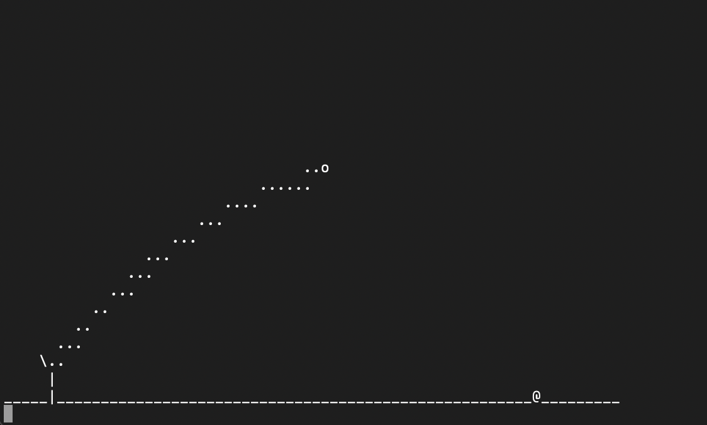

# "Halbzeit"-Projekt zur C++ - Challenge

Dieses Projekt enthält eine Sammlung von Aufgaben zu den Tagen 1-6 aus dem [Grundkurs C++](https://go.tfe.academy/cpp_challenge).

Von Schleifen über Arrays bis zu selbstdefinierten Strukturen wird eine Vielfalt von Themen abgedeckt, mit denen du dein Wissen überprüfen kannst.

Wenn du mit allen Aufgaben fertig bist, dann sollte das fertige Spiel folgendermaßen aussehen:

Der Code in `birds.cpp` ist grundsätzlich lauffähig, allerdings fehlen zum fertigen Spiel zahlreiche Code-Zeilen, die du programmieren musst. Eine Beschreibung findest du an den jeweiligen Stellen im Code.

Wenn du nicht mehr weiterkommst, dann findest du unter `loesung/loesung.cpp` das fertige Spiel mit dem vollständigen Code. Schau aber nicht zu früh nach, sondern versuche es erst ohne Hilfe. 

**Viel Erfolg!**